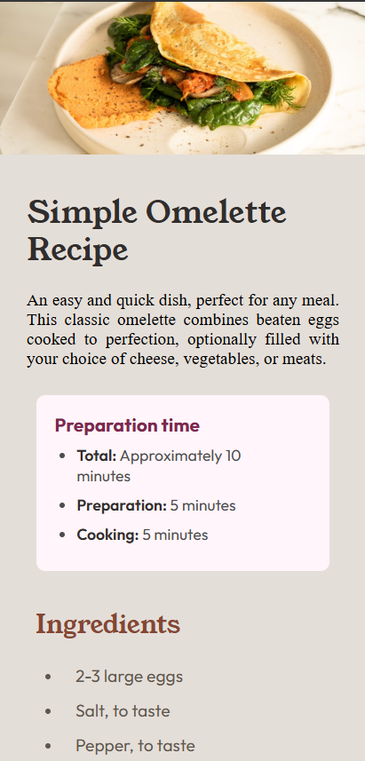

# Frontend Mentor - Recipe page solution

This is my solution to the [Recipe page challenge](https://www.frontendmentor.io/challenges/recipe-page-KiTsR8QQKm) on Frontend Mentor. The project was built to practice HTML and CSS fundamentals while recreating a responsive recipe page layout.

## Overview

### Screenshot

### Links

- Repository URL: https://github.com/lucasprado2008/recipePage/
- Live Site URL: Coming soon

## Built with

- Semantic HTML5
- CSS custom properties
- Flexbox
- CSS Grid
- Mobile-first workflow

## What I learned

During this project, I practiced organizing CSS more clearly and working with spacing and alignment to recreate the proposed layout more accurately.

I also improved my understanding of:

- External fonts
- CSS organization
- Responsive structure
- Layout alignment
- Spacing techniques

## AI Collaboration

No AI tools were used during the development of this project. I only used documentation and reference materials while studying HTML and CSS concepts.

## Author

- GitHub - [Lucas Prado](https://github.com/lucasprado2008)
- Frontend Mentor - [@lucasprado2008](https://www.frontendmentor.io/profile/lucasprado2008)
- LinkedIn - [Lucas Prado](https://www.linkedin.com/in/lucas-prado-8897ba308/)